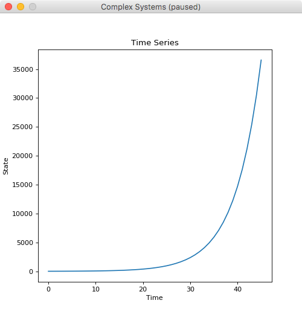
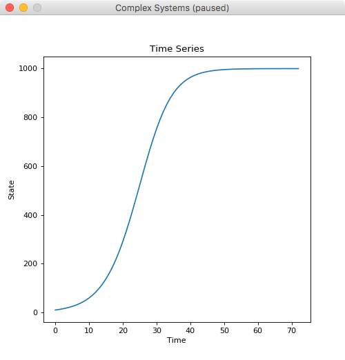

Introductory Tutorial
=====================

In this first contact with the SimCX framework, we will walk you through its
basic components and create an example project in that process.

The framework has been mainly developed as a tool to teach complex systems. As
such, a lot of the design decisions are biased towards that purpose. Most of
the examples have also that bias.

In SimCX there are three base components (implemented as python classes): The
:class:`.Simulator` that implements the simulation core, the :class:`.Visual`
that is used to show the state of a simulator, and the :class:`.Display` that
controls one application window and can contain several visuals. We then
provide, in two submodules, several specific implementations of simulators and
visuals. You can use these, or create your own simulators and visuals, by
deriving the base classes. Regarding the visual components, the framework
supports the use of matplotlib (through the :class:`.MplVisual` class), or you
can use OpenGL directly using the pyglet module.

The framework is generic in the sense that we can use several modelling and
simulation paradigms, like difference equations, differential equations, or
agent-based modelling. In this first tutorial we will focus on using difference
equations to simulate a dynamical system. 

Installation
____________

Before we start, we need to install SimCX and all its dependencies. Be aware
that the framework has been developed for Python 3, and mainly tested on that
version. Nevertheless, we make an effort to make it compatible with Python 2.7.

SimCX is available from the PyPI repository. To install, on a terminal (Command
Prompt on Windows), execute the following command:

.. code-block:: bash

    $ pip install simcx

That command will install SimCX and all its dependencies. Make sure that the pip
command you are running is from the Python version you wish to install the
framework on. On Windows, the pip command may not be on the system path. In that
case you will need to provide the full path to the pip executable, or navigate
to its directory before executing.

Model Description
_________________

In this tutorial we will use SimCX to model population growth using difference
equations. We will use an example taken from Hiroki Sayama's book Introduction
to the Modeling and Analysis of Complex Systems [1]. To start we will model a
population with exponential growth, using the following equation:

.. math::
    x_t = a x_{t-1}

Here, :math:`x_t` is the population size at time step :math:`t`, :math:`x_{t-1}`
is the population size at time step :math:`t-1`, and :math:`a` is the growth
ratio of the population per time step. This simple model will give us an
unbounded exponential growth of the population, which is not very life like. We
can thus consider adding a bound to the size of the population, using the
following equation:

.. math::
    x_t = x_{t-1} + r x_{t-1} \left(1 - \frac{x_{t-1}}{K} \right)

We have introduced a new parameter :math:`K` that represents the carrying
capacity of the environment. Also, we have made the following substitution
:math:`r=a-1`. To get more details on the mathematical modelling and derivation
of these equations, refer to [1].

Implementing the Model
______________________

Let us start with the implementation. We will first need to import the SimCX
package. We will also need some of the ready-made simulator and visual classes
from the sub-modules. In this example, we will use the
:class:`.simulators.FunctionIterator` simulator and the
:class:`.visuals.TimeSeries` visual.

.. code-block:: python

    import simcx
    from simcx.simulators import FunctionIterator
    from simcx.visuals import TimeSeries

We now need to define the function for our first difference equation. To
accommodate different values for our growth rate parameter, we define a python
function that in turn returns a function.

.. code-block:: python

    def eq1(a):
    return lambda x: a * x

Next we will create a new window to control our simulation. This is done by
creating a new instance of the :class:`.Display` class. By default the window is
created with a size of 500x500 pixels. You can change this using the width and
height parameters of the constructor. We will also need our simulator and a plot
to analyse the behaviour of our system. In this case we will use a time series
plot.

.. code-block:: python

    display = simcx.Display()

    a = 1.2     # The growth rate
    x0 = 10     # The initial population size
    sim = FunctionIterator(eq1(a), x0)

    orbit = TimeSeries(sim)

    display.add_simulator(sim)
    display.add_visual(orbit)

    simcx.run()

The code is self-explanatory. We first create the display, then we set the
values for our parameters, and create the simulator. We then create the visual,
and add both to the display. We now have everything setup to run our simulation,
and to do that, simply call the function :func:`.run`. This function will enter
the main loop of the program, displaying the window and awaiting user
interaction. The default keyboard bindings are:

* :kbd:`Space`: Continue or Pause simulation
* :kbd:`S`: Step the simulation
* :kbd:`R`: Reset the simulation (if the simulator supports it)
* :kbd:`ALT+R`: Start recording the window
* :kbd:`F`: Show or hide frames per second

By default, when a display is created, it is in paused mode. You can then run
the simulation step by step by using the :kbd:`S` key, or let the simulation
run with the :kbd:`Space` key. After some iterations of the simulation, you
should se something like what is shown in :numref:`fig1`.

.. _fig1:

    Time series plot of the first model.

It is clear that the population has an exponential growth, and if you try to
continue running the model, you will see that it just keeps increasing. Let us
then improve our simulation, by using the second equation where we introduce the
environments carrying capacity. We will need to define a new function.

.. code-block:: python

    def eq2(r, K):
        return lambda x: x + r*x*(1 - (x / K))

We now need to change our main code block to accommodate this new equation.

.. code-block:: python

    display = simcx.Display()

    a = 1.2
    x0 = 10
    K = 1000
    sim = FunctionIterator(eq2(a - 1, K), x0)

    orbit = TimeSeries(sim)

    display.add_simulator(sim)
    display.add_visual(orbit)

    simcx.run()

Again, running our simulation for some time, we should get something similar to
what is shown in :numref:`fig2`.

.. _fig2:

    Time series plot of the second model.

We now can see that our population does level out when approaching the carrying
capacity of the environment. We can further analyse this system by testing
different initial conditions. Fortunately, both the simulator and visual classes
used, allow us to set more than one value for the initial state. By changing the
line:

.. code-block:: python

    x0 = [0, 10, 200, 1000]

We are now testing all these four initial values for the population size. Run
the simulation and see what you get.

To end this first tutorial we will make a movie of our simulation run. The
framework already provides this capability. To create the movie, you can simply
add to your code, before the simcx.run() line, the following:

.. code-block:: python

    display.start_recording('movie.mp4')

This will create a movie file, with the filename provided. The recording will
span the whole simulation run. From the start, up to the application close. For
each step of the simulation, one frame will be recorded. By default, the movie
will be recorded with a frame rate of 20 fps, but that can be changed by passing
the fps parameter to the :meth:`.Display.start_recording` method. We can also
alter the bitrate of the recording from the default of 1800 Kbps. You can also
start a recording during any simulation without adding any code, simply by
using the :kbd:`ALT+R` keyboard shortcut. In that case, the file will have the
default name of *simcx.mp4*.

In this example we mostly made use of the simulators and visuals that are
provided with the framework. To make full use of SimCX, though, you may need to
implement your own simulators and visuals. To get an idea of how the ones used
in this tutorial work, have a look at the reference (and code) for both the
:class:`.simulators.FunctionIterator` and the :class:`.visuals.TimeSeries`
classes. In another tutorial we will show you how to create your own.

